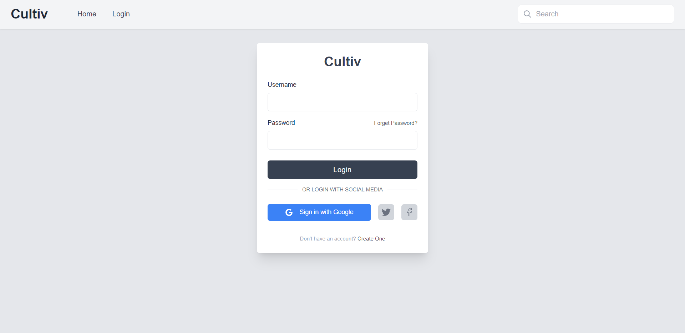

# Cultive Blog Frontend Challenge

### To run this project locally 
- clone this repo 

```
git clone https://github.com/eslamwaeldev/cultiv-blog-frontend-challenge
```
```
cd cultiv-blog-frontend-challenge
```
```
yarn
```
```
yarn dev
```
- open new terminal

```
yarn json-graphql-server  graphql-server.json --p 5000
```

# Preview

### Home Page


### Login Page



### Blog Page


